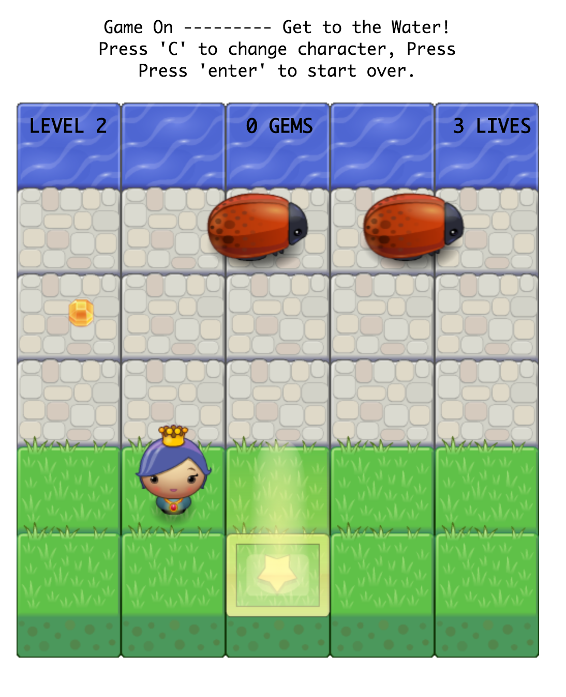

frontend-nanodegree-arcade-game
===============================

This is my version of a frogger-like arcade game for project 3 of the [Udacity Front-End Web Developer Nanodegree]
(https://www.udacity.com/course/nd001).

This project provided experience with object-oriented Javascript and the HTML5 Canvas.


###Playing the Game:

The goal of the game is to avoid the enemy bugs and successfully
make it to the water. You can get bonus points collecting gems.

To play the game, clone it from my github account:

```
git clone https://github.com/adai183/frontend-nanodegree-arcade-game.git
```

and then open index.html in your browser.


Or run the online [online version] 
(http://adai183.github.io/frontend-nanodegree-arcade-game/)

**Controls:**

* Move up: up arrow key<br>
* Move down: down arrow key<br>
* Move left: left arrow key<br>
* Move right: right arrow key<br>
* Change character: C key<br>


Enjoy!





###Resources Used:

**Primary Courses**

* [Object-Oriented Javascript](https://www.udacity.com/course/ud015)
* [HTML5 Canvas](https://www.udacity.com/course/ud292)

**Additional Resources**

* [Udacity Style Guide](http://udacity.github.io/frontend-nanodegree-styleguide/javascript.html)
* [Mozilla article on 2D Collision detection](https://developer.mozilla.org/en-US/docs/Games/Techniques/2D_collision_detection)
* [Stackoverflow] (http://stackoverflow.com/)

